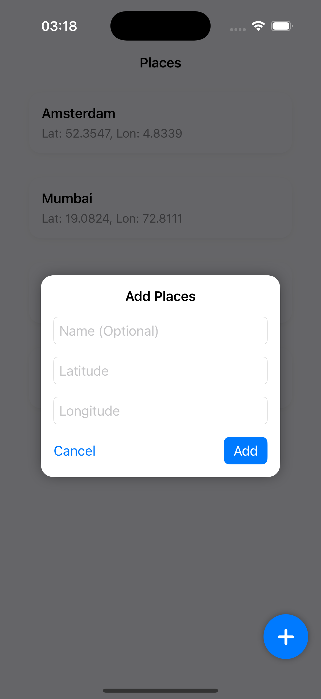
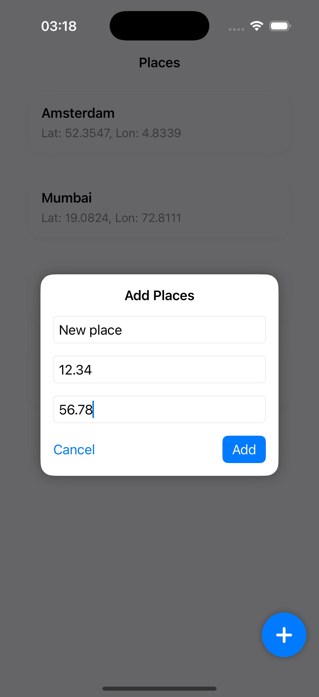
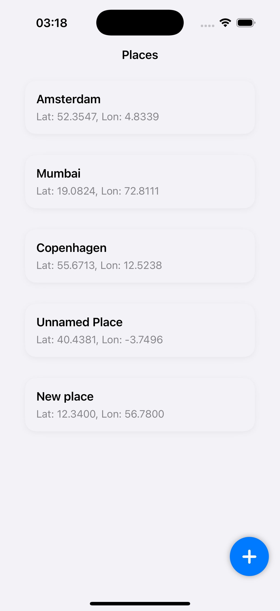
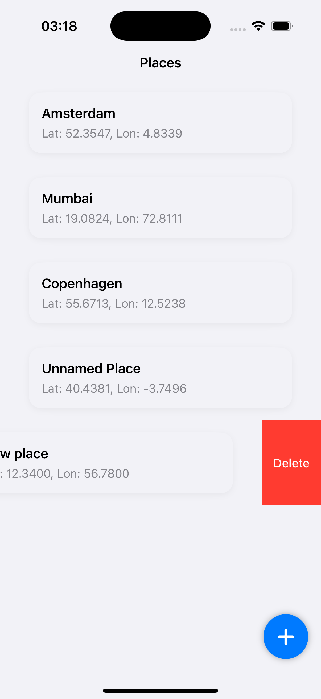
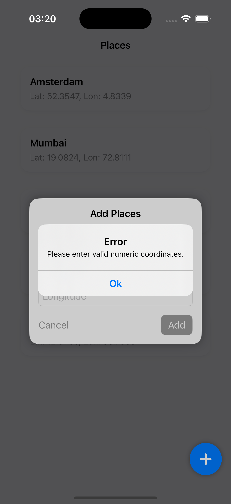
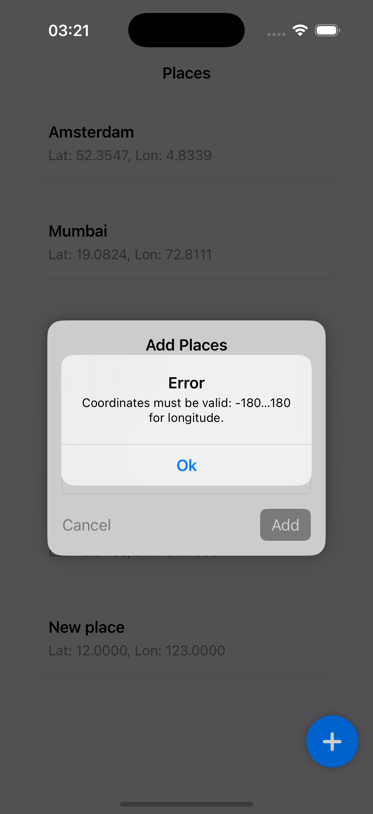

# 📍 Places — iOS Deep Linking Demo App

**Places** is a SwiftUI-based iOS application that demonstrates deep linking into a custom-modified Wikipedia app.  
The app presents a list of geolocations retrieved from a remote JSON file and allows users to add, delete, and interact with custom locations. Selecting any place opens Wikipedia directly at that coordinate using a custom URL scheme.

---

## ✨ Key Features

- **Predefined Locations**  
  Loads an initial list of places from a hosted JSON file.

- **Custom Place Entry**  
  Users can add new locations manually via a popup form with coordinate validation.

- **Deletion Support**  
  Any place, including custom ones, can be deleted from the list.

- **Deep Linking**  
  Tapping on a place opens a custom Wikipedia deep link formatted as:  
  `wikipedia://places?lat=52.37&lon=4.89`

- **MVVM Architecture**  
  Clean separation of concerns with `ViewModel`-driven logic.

- **Swift Concurrency**  
  All asynchronous operations are handled using `async/await`.

- **Unit Testing**  
  Core business logic (e.g. input validation, location creation) is covered by tests.

---

## 🧭 Deep Link Format

```text
wikipedia://places?lat=LATITUDE&lon=LONGITUDE
```

When a user taps on a location, this URL is constructed and passed to the modified Wikipedia app via `UIApplication.shared.open`.

---

## 📸 Screenshots

> Add your screenshots to the `Resources/` directory and use the template below to display them:

<p float="left">
  
  
</p>

<p float="center">
  
  
</p>

<p float="center">
  
  
  
</p>

---

## 📦 Architecture Overview

- **UI Layer:** Built with SwiftUI  
- **ViewModels:** ObservableObjects managing logic and validation  
- **Model Layer:** Struct-based models conforming to `Codable`  
- **Networking:** Basic `URLSession` for fetching remote JSON  
- **Testing:** Logic tests implemented via XCTest

---

## 🔧 Modifications in the Wikipedia App

To support coordinate-based deep linking from the Places app, several targeted changes were made in the Wikipedia app codebase. These modifications allow the app to parse incoming coordinates and open the Places tab directly at the specified location.

### 1. Modified `wmf_placesActivityWithURL:`

An existing method was updated to additionally extract `lat` and `lon` query parameters from the URL and include them in the `NSUserActivity`'s `userInfo` dictionary.

Key additions:
- Parsing latitude and longitude from query items
- Attaching them to `userInfo`:
  - `userInfo[@"lat"] = latitude`
  - `userInfo[@"lon"] = longitude`

---

### 2. Activity Handling in App Router

The `WMFUserActivityTypePlaces` case was extended to support coordinate-based routing:

- If `lat` and `lon` are present in `userInfo`, the app:
  - Switches to the **Places** tab
  - Calls `showCoordinatesWithLatitude:longitude:` on the view controller
- If only `WMFArticleURL` is provided, it falls back to opening the article

---

### 3. Added Method `showCoordinatesWithLatitude:longitude:` in `PlacesViewController`

This new method:
- Converts the provided values into `CLLocation`
- Either calls `showCoordinates(_:)` immediately (if view is loaded)
- Or stores the coordinates in `pendingCoordinates` to be handled on `viewDidAppear`

---

### 4. Triggered Coordinate Display on `viewDidAppear`

If `pendingCoordinates` is set, the map will zoom to that location as soon as the view is ready.

---

### 5. Used Internal Map Logic

The existing `zoomAndPanMapView(toLocation:)` was reused to center the map without affecting user location tracking.

## 🔗 Pull Request to Wikipedia iOS App

Deep linking support in the Places app is enabled through changes made in a fork of the Wikipedia iOS application.

You can review the implementation here: 
[Pull Request #1 – Mirzoeva/wikipedia-ios-deeplink](https://github.com/Mirzoeva/wikipedia-ios-deeplink/pull/1)

## 🚀 Getting Started

1. Clone the repository:
   git clone https://github.com/your-username/Places.git

2. Open the project:
   open Places.xcodeproj

3. Build and run:
   - Requires Xcode 15 or later
   - Compatible with iOS 17+
   - Use the "+" button to add a custom place
   - Tap on any place to open it in the modified Wikipedia app via deep link

## Author

Created with by Uma Mirzoeva
